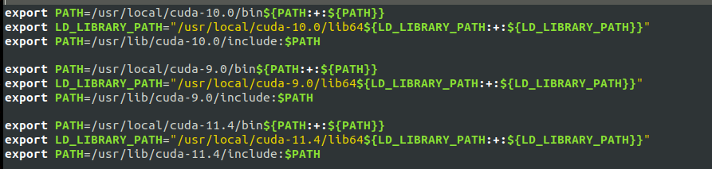

# **Required Packages for your Work Environment**

---

## GPU Drivers, CUDA TooolKit, and cuDNN Library:

---

#### First update your system:

```
$ sudo apt-get update 

$ sudo apt-get upgrade
```


#### Show available drivers:
 
```
$ ubuntu-drivers devices
```


#### **Install Nvidia Drivers (2 ways, depending on your preference)**:

``` 
 $ sudo ubuntu-drivers autoinstall
```

#### **OR (Preferable Option)**
```
$ sudo apt install nvidia-driver -< latest version available for your pc>
```
#### e.g.: sudo apt install nvidia-driver-460 
<br>

```
$ sudo reboot
```

#### Detect if there nvidia drivers are installed:

```
$ nvidia-smi
```

#### Example output if they are installed correctly:


#### Change your drivers (most-likely from) on-demand to now installed nvidia: 
```
$ sudo prime-select query

$ sudo prime-select nvidia

$ sudo prime-select query
```

#### **Install CUDA toolkit (2 ways, depending on your preference)**:
```
$ sudo apt update

$ sudo apt install nvidia-cuda-toolkit

$ sudo reboot
```
#### Check CUDA version to confirm the installation:
```
$ nvcc --version
```
#### **OR (Option 2: Ensures the latest version of Cuda is installed)**:
```
$ wget https://developer.download.nvidia.com/compute/cuda/repos/ubuntu2004/x86_64/cuda-ubuntu2004.pin

$ sudo mv cuda-ubuntu2004.pin /etc/apt/preferences.d/cuda-repository-pin-600

$ wget https://developer.download.nvidia.com/compute/cuda/11.4.2/local_installers/cuda-repo-ubuntu2004-11-4-local_11.4.2-470.57.02-1_amd64.deb

$ sudo dpkg -i cuda-repo-ubuntu2004-11-4-local_11.4.2-470.57.02-1_amd64.deb

$ sudo apt-key add /var/cuda-repo-ubuntu2004-11-4-local/7fa2af80.pub

$ sudo apt-get update

$ sudo apt-get -y install cuda-11.4
```
#### **You have to also install the cuDNN Library from Nvidia (its free but you have to sign up)**:

> The following instructions are from this [Link](https://neptune.ai/blog/installing-tensorflow-2-gpu-guide)

> Run the following comands after downloading the [cuDNN library](https://developer.nvidia.com/rdp/form/cudnn-download-survey):
```
$ tar -xvzf cudnn-11.4-linux-x64-v8.2.4.15.tgz
```
> Move the cuDNN libraries corresponding to CUDA X.X path.
```
$ sudo cp cuda/include/cudnn*.h /usr/local/cuda-11.4/include

$ sudo cp cuda/lib64/libcudnn* /usr/local/cuda-11.4/lib64

$ sudo chmod a+r /usr/local/cuda-11.4/include/cudnn.h /usr/local/cuda-11.4/lib64/libcudnn* 
```
#### Chances are when installing cuDNN the library files are not linked it good practice to link these:

> To link cudnn Library files (These are where you copied them in /usr/local/cuda-11.4/lib64/) :
  -  Copy and Paste the Code on `CUDA-GPU-Config/cudnn-cuda-11-4-LL.txt` onto the terminal.

#### Export CUDA environment variables(set your path to point to CUDA binaries):

> Article to understand [Setting your path](https://opensource.com/article/17/6/set-path-linux)
```
$ echo 'export PATH=/usr/local/cuda-11.4/bin${PATH:+:${PATH}}' >> ~/.bashrc

$ echo 'export LD_LIBRARY_PATH="/usr/local/cuda/lib64:/usr/local/cuda-11/lib64:/usr/local/cuda-11.4/lib64${LD_LIBRARY_PATH:+:${LD_LIBRARY_PATH}}"' >> ~/.bashrc

$ echo 'export PATH=/usr/lib/cuda-11.4/include:$PATH' >> ~/.bashrc

$ sudo reboot
```
#### Check CUDA version to confirm the installation:
```
$ nvcc --version
```
#### Check cuDNN:
```
$ /sbin/ldconfig -N -v $(sed ‘s/:/ /’ <<< $LD_LIBRARY_PATH) 2>/dev/null | grep libcudnn
```
---

## Python3 and Anaconda:

---

#### Install Python3:
```
$ sudo apt install python3-pip

$ pip3 --version
```

#### Install Anaconda Follow the steps in this [link](https://docs.anaconda.com/anaconda/install/linux/):

> Pre-recquisite (To use GUI packages with Linux,):
```
$ sudo apt-get install libgl1-mesa-glx libegl1-mesa libxrandr2 libxrandr2 libxss1 libxcursor1 libxcomposite1 libasound2 libxi6 libxtst6
```
> After Downloading the [Anaconda installer for linux.](https://docs.anaconda.com/anaconda/install/linux/#:~:text=Anaconda%20installer%20for%20Linux)

> RECOMMENDED: Verify data integrity with [SHA-256](https://docs.anaconda.com/anaconda/install/hashes/). For more information on hashes, see What about cryptographic [hash verification](https://conda.io/projects/conda/en/latest/user-guide/install/download.html#cryptographic-hash-verification)
```
$ sha256sum /path/filename 
```

#### e.g. sha256sum Downloads/Anaconda3-2021.05-Linux-x86_64.sh if the anaconda installer was placed in the downloads path.

<br>


> Enter the following to install Anaconda for Python 3.7 or later:
```
$ bash ~/Downloads/Anaconda3-2021.05-Linux-x86_64.sh
```
> Follow the steps on the provided link in the beginning (from step 4 - 10):

> Note you don't have to install pycharm Pro for anaconda, you can just use pycharm community because it's free.

---
## Install basic Python packages (Most of these should already be installed so this also is a sanity check):

---
```
$ pip3 install pandas

$ pip3 install matplotlib

$ pip3 install seaborn

$ pip3 install numpy

$ pip3 install scipy

$ pip3 install yellowbrick

$ pip3 install plotly

$ pip3 install cufflinks

$ pip3 install jupyterlab
```
> Additional Packages:
```
$ sudo apt install vim

$ sudo apt install jupyter-core

$ sudo apt update
```
---

## Computer Vision Packages (You may want to install these in a new environment):

---
#### Install tensorflow:
```
$ pip3 install testresources 
```
> Add path to testresources binaries:
```
$ echo 'export PATH=/home/siyanda/.local/bin${PATH:+:${PATH}}' >> ~/.bashrc

$ pip3 install tensorflow
```
 
#### Install OpenCV: 
```
$ pip3 install opencv-python==4.5.2.54 

$ pip3 install opencv-contrib-python==4.5.2.54

$ sudo apt install libopencv-dev
```

> As of this document, later versions of opencv (4.5.3+) generate errors so choose the above version.

> Make sure you install libopencv-dev to avoid alot of errors [read here](https://stackoverflow.com/questions/45450706/whats-the-difference-with-opencv-python-opencv-and-libopencv) what the difference between opencv, opencv-contrib & libopencv-dev is all about.


#### Install pycharm:
```
$ sudo snap pycharm-commercial 
```

#### Additional packages:
```
$ pip3 install scikit-image

$ pip3 install imgaug

$ pip3 install pycocotools

$ pip3 install h5py==2.10.0 
```

>Working with object detection algorithms such as mask R-CNN requires earlier versions of Tensorflow: 
> Tensorflow Version 1.8 (or earlier) <br>
>The version of Cuda and cuDNN that are compatible with TensorFlow.v1 are CUDA-9.0 and cuDNN-7 
> (See Cuda & cuDNN installation instructions below),<br>
> Note you would have to create a separate Anaconda environment for this as well.

#### The following are some important packages compatible with an MRCNN Algorithm: 
> keras version 2.0.8:
```
$ pip3 install keras==2.0.8
```
> tensorflow version 1.8 or earlier:
```
$ pip3 install tensorflow-gpu==1.8.0
```
> version mrcnn 0.1:
```
$ pip3 install mrcnn==0.1
```
---
## Git Setup:

---

#### Install and setup git:
```
$ sudo apt install git

$ sudo reboot

$ git config --list

$ git config --global user.name "John Doe"

$ git config --global user.email johndoe@example.com

$ git config --global core.editor gedit 
```
* The editor can be emacs/vim or any other edit of personal choice.

#### Link your local and remote repository using the SSH key on Gitlab:

$ ssh-keygen 

* The public ssh key is the .ssh/id_rsa.pub file in the .ssh hidden folder.<br>
* Copy this and paste it under preferences > ssh keys > add ssh key on gitlab. 

---
## Creating a new work environment:

---


#### Create Separate Environments (Make sure to clone the base to get a copy of its packages):
```
$ conda create -n DataScience --clone base

$ conda env list

$ conda create -n ComputerVision --clone base

$ conda env list
```
#### To activate an environment:
```
$ conda activate ComputerVision
```
#### If you need to remove an environment:
```
$ conda deactivate

$ conda env remove -n ComputerVision
```

#### To create a new environment with a different/downgraded version of python 
> * You may have to also create a new python kernel for your different version of python<br>
> * Follow the instructions on this [Link](https://ipython.readthedocs.io/en/stable/install/kernel_install.html) <br>
> * You do this to manage different package versions (e.g.tensorflow==1.13 which is not compatible with Python3.8+)
```
$ conda create -n <new_env_name> python=3.<version> anaconda  # '=' -> latest version, '==' -> exact version 

$ conda activate <new_env_name>
```
#### Install the kernel in this specific environment (Should already come with anaconda environment so this is a sanity check): 
```
$ pip3 install ipykernel
```
####  Creating a custom kernel with a name:
> Once your environment is setup, it can be added as a kernel to Jupyter lab/notebook by:

```
$ python -m ipykernel install --user --name <env_name> --display-name 'Python(<env_name>)'
```
> Once the kernerl is installed you may switch back to base. 

#### To uninstall unwanted python kernel:
```
$ jupyter kernelspec list

$ jupyter kernelspec uninstall <unwanted-kernel_name>
```

## **Miscelleneous**:

---

### You may have to install a different versions of CUDA and cuDNN (For example if you're using a different version 
### of tensorflow that requires downgraded versions.)
> The following commands are from the combination of the two links below:
> * [Link 1](https://towardsdatascience.com/installing-multiple-cuda-cudnn-versions-in-ubuntu-fcb6aa5194e2) 
> * [Link 2](https://medium.com/thecyphy/multi-version-cuda-and-tensorflow-gpu-on-ubuntu-18-04-lts-22cfcd32f06a#id_token=eyJhbGciOiJSUzI1NiIsImtpZCI6IjhkOTI5YzYzZmYxMDgyYmJiOGM5OWY5OTRmYTNmZjRhZGFkYTJkMTEiLCJ0eXAiOiJKV1QifQ.eyJpc3MiOiJodHRwczovL2FjY291bnRzLmdvb2dsZS5jb20iLCJuYmYiOjE2MzI4NzIzOTQsImF1ZCI6IjIxNjI5NjAzNTgzNC1rMWs2cWUwNjBzMnRwMmEyamFtNGxqZGNtczAwc3R0Zy5hcHBzLmdvb2dsZXVzZXJjb250ZW50LmNvbSIsInN1YiI6IjExMzg1NzEyMTAxNzMxOTkwOTU1MSIsImVtYWlsIjoic25nY29ibzQ5QGdtYWlsLmNvbSIsImVtYWlsX3ZlcmlmaWVkIjp0cnVlLCJhenAiOiIyMTYyOTYwMzU4MzQtazFrNnFlMDYwczJ0cDJhMmphbTRsamRjbXMwMHN0dGcuYXBwcy5nb29nbGV1c2VyY29udGVudC5jb20iLCJuYW1lIjoiU2l5YW5kYSBTJ3BoZXNpaGxlIE5nY29ibyIsInBpY3R1cmUiOiJodHRwczovL2xoMy5nb29nbGV1c2VyY29udGVudC5jb20vYS0vQU9oMTRHaDhiV3ZHWEFzYnpCOXBzTjJEd1FoeEZ5ODdFQnN5aWpXRkZaU21NZz1zOTYtYyIsImdpdmVuX25hbWUiOiJTaXlhbmRhIFMncGhlc2lobGUiLCJmYW1pbHlfbmFtZSI6Ik5nY29ibyIsImlhdCI6MTYzMjg3MjY5NCwiZXhwIjoxNjMyODc2Mjk0LCJqdGkiOiIzYmRlODM1YzU0ZTk4NDU1ZDA5ZTY0MTBhZDBhYTBlM2YwMmU1ZTEzIn0.LRclEv-LjyY8HHMGR8IX3uQ438ZbJzM_RSnCFQMJV4q6Wg8sJsfT0__FxAPxQJ-5D8o574FgWyqpaAq2NZrB-9FMDHxiPsSnBR78Ftx9djBJVSn2XwipFZRFQ_2DdWGUycALurMqrIuHpssh2L2_s0O_ScYG36lY5sKM-WujpU06wejbyrbhn_k47YY67SoABuVkkdGU4oWBDp2n-UaxZ58mDdrSKLWoOkbokdUbm9f378wSnJd-6F0E0zaDWxC0u-MHMOPjyj2peDlGg7DCNkYlJpx_0NfKYYR9J_YtvJy0wXDxtHQbxM1cgL8VtNVCoYMNH05CqJS4GDzFIzAkEQ)

#### <b> [Tensorflow-Keras-CUDA-cuDNN compatibility table](https://www.tensorflow.org/install/source#gpu) </b>

<br>

#### (1) Install the version of the [CUDA Toolkit](https://developer.nvidia.com/cuda-toolkit-archive) you need.
- Before You start make sure you disable any active anaconda environment (including base)!
  
- (Here you follow the instructions for CUDA Toolkit installation using option 2 above,
 however instead of installing the latest version you install the version you need):

```
$ wget https://developer.download.nvidia.com/compute/cuda/X.X.X/local_installers/cuda-repo-ubuntu<version>-local_X.X.X-XXX.XX.XX-X_amd64.deb

$ sudo dpkg -i cuda-repo-ubuntu<version>-local(-XX.X.XX.X)_X.X.X-XXX.XX.XX-X_amd64.deb

$ sudo apt-key add /var/cuda-repo-<version>-local(-XX.X.XX.X)/7fa2af80.pub

$ sudo apt-get update

$ sudo apt-get -y install cuda-X.X
```
#### (2) You have to install cuDNN from Nvidia (its free but you have to sign up):

> The following instructions are from this [link](https://neptune.ai/blog/installing-tensorflow-2-gpu-guide)

> Run the following comands after downloading the [cuDNN](https://developer.nvidia.com/rdp/form/cudnn-download-survey):
```
$ tar -xvzf cudnn-X.X-linux-<version>.tgz
```

> Move the cuDNN libraries corresponding to CUDA X.X path:
```
$ sudo cp cuda/include/cudnn*.h /usr/local/cuda-X.X/include

$ sudo cp cuda/lib64/libcudnn* /usr/local/cuda-X.X/lib64

$ sudo chmod a+r /usr/local/cuda-X.X/include/cudnn.h /usr/local/cuda-X.X/lib64/libcudnn* 
```
#### Chances are when installing cuDNN the library files are not linked it good practice to link these:

> To link cudnn Library files (These are where you copied them in /usr/local/cuda-11.X/lib64/) :
-  Copy and Paste the Code on `CUDA-GPU-Config/cudnn-cuda-11-X-LL.txt` on to the terminal.


#### (3) Reinstall The Latest Nvidia drivers (Incase this earlier version of CUDA downgrades them):
```
$ sudo apt-get install -y libnvidia-compute-< latest version for your pc > #e.g libnvidia-compute-470

$ sudo apt install nvidia-driver-< latest version for your pc > #e.g. nvidia-driver-470
```
#### (4) Export CUDA environment variables(set your path to point to CUDA binaries). To set them, run:
```
$ echo 'export PATH=/usr/local/cuda-X.X/bin${PATH:+:${PATH}}' >> ~/.bashrc

$ echo 'export LD_LIBRARY_PATH="/usr/local/cuda-X.X/lib64${LD_LIBRARY_PATH:+:${LD_LIBRARY_PATH}}"' >> ~/.bashrc

$ echo 'export PATH=/usr/lib/cuda-X.X/include:$PATH' >> ~/.bashrc
```
#### (5) Reboot your system:
```
$ sudo reboot
```
#### (6) Check CUDA version to confirm the installation:

$ nvcc --version

#### (7) Check cuDNN:
```
$ /sbin/ldconfig -N -v $(sed ‘s/:/ /’ <<< $LD_LIBRARY_PATH) 2>/dev/null | grep libcudnn
```
---
> To change the currently active version of cuda to that you need, you need to move the 
> copied path that points to cuda binaries towards the end of the .bashrc file:
```
$ gedit ~/.bashrc
```
> The following shows 3 cuda versions with version cuda-11.4 being active: 




---
## If ever you need to uninstall the nvidia-drivers (If they get corrupted; There's a miss-match between drivers and libraries):

---

#### The following command shows all available packages that are related to nvidia: 
```  
$ dpkg -l | grep -i nvidia
```
#### This command below removes all of the nvidia-packages:
```
$ sudo apt-get remove --purge '^nvidia-.*' 
```
#### Incase the above command doesnt work try the one below:
```
$ sudo dpkg -P $(dpkg -l | grep nvidia | awk '{print $2}')
```
#### Purge any remaining NVIDIA configuration files and the associated dependencies that they may have been installed with:
```
$ sudo apt autoremove

$ sudo apt autoclean

$ sudo apt-get install ubuntu-desktop
```
---
## If you ever need to uninstall the current version of the CUDA Toolkit 

---

#### Open a terminal window and type the following three commands to get rid of any CUDA packages you may already have installed:
```
$ sudo apt remove --autoremove nvidia-cuda-toolkit

$ sudo apt-get --purge -y remove 'cuda*'
```
#### Purge any remaining CUDA configuration files and the associated dependencies that they may have been installed with:
```
$ sudo apt-get autoremove

$ sudo apt-get autoclean
```
#### Remove any existing CUDA folders you may have in /usr/local/
> There shouldn’t be any folders with the name “cuda” or “cuda-anything” in usr/local/ at this point!
```
$ ls /usr/local/ | grep cuda

$ sudo rm -rf /usr/local/cuda*
```

---
## OPENCV With GPU Support

---
> Make Sure opencv is built with [CUDA](https://www.pyimagesearch.com/2020/02/03/how-to-use-opencvs-dnn-module-with-nvidia-gpus-cuda-and-cudnn/):

#### Install OpenCV and “dnn” GPU dependencies:
```
$ sudo apt-get update

$ sudo apt-get upgrade

$ sudo apt-get install build-essential cmake unzip pkg-config

$ sudo apt-get install libjpeg-dev libpng-dev libtiff-dev

$ sudo apt-get install libavcodec-dev libavformat-dev libswscale-dev

$ sudo apt-get install libv4l-dev libxvidcore-dev libx264-dev

$ sudo apt-get install libgtk-3-dev

$ sudo apt-get install libatlas-base-dev gfortran

$ sudo apt-get install python3-dev
```
> Download OpenCV source code:<br>
> <u> There is no “pip-installable” version of OpenCV that comes with NVIDIA GPU support — instead, 
> we’ll need to compile OpenCV from source code with the proper NVIDIA GPU configurations set. </u>
```
$ cd ~

$ wget -O opencv.zip https://github.com/opencv/opencv/archive/4.5.2.zip

$ wget -O opencv_contrib.zip https://github.com/opencv/opencv_contrib/archive/4.5.2.zip

$ unzip opencv.zip

$ unzip opencv_contrib.zip

$ mv opencv-4.5.2 opencv

$ mv opencv_contrib-4.5.2 opencv_contrib

$ cd opencv

$ mkdir build
```
> * Create anaconda env (commands above)
> * Then run the following command to avoid conflict with system files:
```
$ conda uninstall libtiff
```
#### Chances are when installing cuDNN the library files are not linked for opencv these need to be linked:

> To link cudnn Library files (These are where you copied them in /usr/local/cuda-11.X/lib64/) :

```
$ ls -al  # check if files are linked (They should be as done earlier)
```

> If the cudnn libraries are not linked link them using the code in  `CUDA-GPU-Config/cudnn0-cuda-11-X-ll.txt` and paste it to the terminal based on the active version of cuda(cuda-11.X):
```
$ sudo ln -sf libcudnn.so.X.X.X libcudnn.so.X; 
  sudo ln -sf libcudnn.so.8 libcudnn.so; 
  sudo ln -sf libcudnn_adv_infer.so.X.X.X libcudnn_adv_infer.so.X; 
  sudo ln -sf libcudnn_adv_infer.so.X libcudnn_adv_infer.so; 
  sudo ln -sf libcudnn_adv_train.so.X.X.X libcudnn_adv_train.so.X; 
  sudo ln -sf libcudnn_adv_train.so.X libcudnn_adv_train.so;
  sudo ln -sf libcudnn_cnn_infer.so.X.X.X libcudnn_cnn_infer.so.X;
  sudo ln -sf libcudnn_cnn_infer.so.X libcudnn_cnn_infer.so;
  sudo ln -sf libcudnn_cnn_train.so.X.X.X libcudnn_cnn_train.so.X;
  sudo ln -sf libcudnn_cnn_train.so.X libcudnn_cnn_train.so;
  sudo ln -sf libcudnn_ops_infer.so.X.X.X libcudnn_ops_infer.so.X;
  sudo ln -sf libcudnn_ops_infer.so.X libcudnn_ops_infer.so;
  sudo ln -sf libcudnn_ops_train.so.X.X.X libcudnn_ops_train.so.X;
  sudo ln -sf libcudnn_ops_train.so.X libcudnn_ops_train.so;

```
#### Makefile commands required:
> See opencv-makefile
```
$ cd ~/opencv/build
```
> copy  opencv-makefile file and paste in the ~/opencv/build directory

#### After running the makefile build commands:
```
$ make -j<cpu-cores>

$ sudo make install

$ sudo ldconfig

$ cd \<install path\> 
```
#### e.g. cd ~/anaconda3/envs/cv2_GPU/lib/python3.9/site-packages/cv2/python-3.9
<br>

```
$ ls -l
```
> Depending on where you chose the cmake install prefix in my case same I chose the cv2_GPU env prefix:
```
$ sudo ln -s cv2.cpython-39-x86_64-linux-gnu.so cv2.so 
```
> Check if the symlink worked
```
$ ls -al 
```
---
## ROS Noetic(Ubuntu20.04)

---

#### Creating a ROS Work Space:

> Python 3 users in ROS Melodic and earlier: note, if you are building ROS from source to achieve <br>Python 3 compatibility, and have setup your system appropriately (ie: have the Python 3 versions <br>of all the required ROS Python packages installed, such as catkin) the first catkin_make command <br>in a clean catkin workspace must be:
```
$ catkin_make -DPYTHON_EXECUTABLE=/usr/bin/python3
```
* This will configure catkin_make with Python 3. You may then proceed to use just catkin_make for <br>subsequent builds.

> Source new setup file on devel folder in the catkin workspace (setup.bash) :
```
$ source devel/setup.bash
```
> Or permanently to the bashrc:
```
$ echo "source ~/catkin_ws/devel/setup.bash" >> ~/.bashrc
```