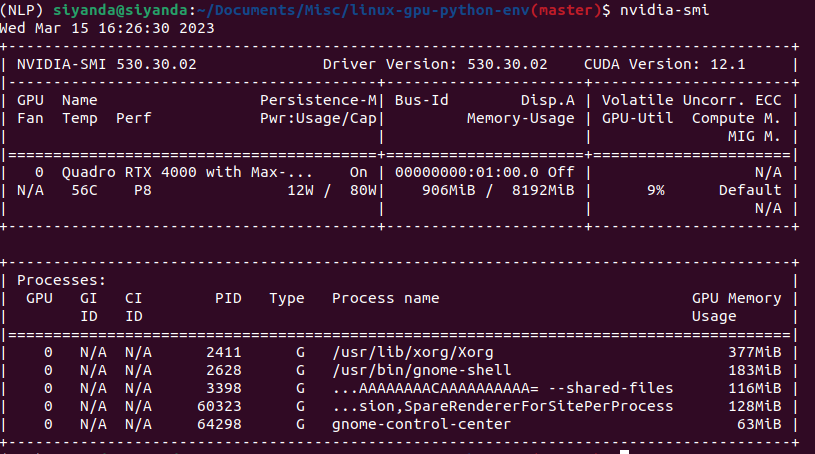
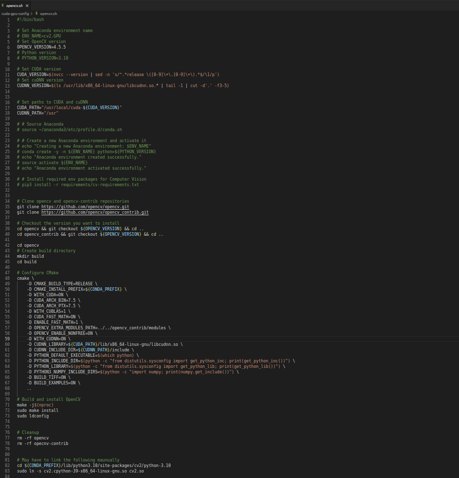

<h1 style="text-align:center;background-color:DodgerBlue;"> Linux Work Environment Setup </h1>

---

<h2 style="background-color:Aquamarine; color:black"> GPU Drivers, CUDA TooolKit, and cuDNN Library: </h2>

---
<br>
<h3 style="text-align:center;background-color:Aquamarine; color:black"> GPU Drivers </h3>
<br>
<h4 style="background-color:LightGray; color:black;"> First update your system: </h4>

```
$ sudo apt-get update 

$ sudo apt-get upgrade
```


<h4 style="background-color:LightGray; color:black;"> Show available drivers: </h4>
 
```
$ ubuntu-drivers devices
```

<h4 style="background-color:LightGray; color:black;" id="nvidia-driver"> Install Nvidia Drivers (2 ways, depending on your preference): </h4>

``` 
 $ sudo ubuntu-drivers autoinstall
```

<h4 style="background-color:LightGray; color:black;"> OR (Preferable Option)</h4>

```
$ sudo apt install nvidia-driver -< latest version available for your pc>
```
<h4 style="background-color:LightGray; color:black;"> e.g.: sudo apt install nvidia-driver-460 </h4>
<br>

```
$ sudo reboot
```

<h4 style="background-color:LightGray; color:black;"> Detect if there nvidia drivers are installed: </h4>

```
$ nvidia-smi
```

<h4 style="background-color:LightGray; color:black;"> Example output if they are installed correctly:</h4>




<h4 style="background-color:LightGray; color:black;"> Change your drivers (most-likely from) on-demand to now installed nvidia: </h4>

```
$ sudo prime-select query

$ sudo prime-select nvidia

$ sudo prime-select query
```
<br>
<h3 style="text-align:center;background-color:Aquamarine; color:black"> Install CUDA toolkit (2 ways, depending on your preference) </h3>
<br>
<h4 style="background-color:LightGray; color:black;"> First update your system: </h4>

```
$ sudo apt update

$ sudo apt install nvidia-cuda-toolkit

$ sudo reboot
```
<h4 style="background-color:LightGray; color:black;"> Check CUDA version to confirm the installation:</h4>

```
$ nvcc --version
```
<h4 style="background-color:LightGray; color:black;" id="cuda_install"> OR (Option 2: Ensures the latest version of Cuda is installed):</h4>

```
$ wget https://developer.download.nvidia.com/compute/cuda/repos/ubuntu2204/x86_64/cuda-ubuntu2204.pin

$ sudo mv cuda-ubuntu2204.pin /etc/apt/preferences.d/cuda-repository-pin-600

$ wget https://developer.download.nvidia.com/compute/cuda/12.1.0/local_installers/cuda-repo-ubuntu2204-12-1-local_12.1.0-530.30.02-1_amd64.deb

$ sudo dpkg -i cuda-repo-ubuntu2204-12-1-local_12.1.0-530.30.02-1_amd64.deb

$ sudo cp /var/cuda-repo-ubuntu2204-12-1-local/cuda-*-keyring.gpg /usr/share/keyrings/

$ sudo apt-get update

$ sudo apt-get -y install cuda
```
<br>
<h3 style="text-align:center;background-color:Aquamarine; color:black" id="cuDNN_install">Install cuDNN - CUDA Deep Learning Library </h3>
<br>
<h4 style="background-color:LightGray; color:black;"> You have to also install the cuDNN Library from Nvidia (it's free, but you have to sign up)</h4>

<p style = "background-color:LightSkyBlue;color:black"> Download <a href="https://developer.nvidia.com/rdp/form/cudnn-download-survey"> cuDNN library </a></p>
<p style = "background-color:LightSkyBlue;color:black"> Installation  guide for<a href="https://docs.nvidia.com/deeplearning/cudnn/install-guide/index.html"> cuDNN library </a></p>
<br>
<br>

<h4 style="background-color:LightSteelBlue; color:black">1. Tar File Installation: </h4>

```
$ tar -xf cudnn-X.X-linux-x86_64-vX.X.X.X.tgz.xz
$ cd cudnn-X.X-linux-x86_64-vX.X.X.X.tgz.xz/
```
<h5 style="background-color:LightGray; color:black;"> Move the cuDNN libraries corresponding to CUDA X.X path. </h5>

```
$ sudo cp include/cudnn*.h /usr/local/cuda-X.X/include

$ sudo cp lib/libcudnn* /usr/local/cuda-X.X/lib64

$ sudo chmod a+r /usr/local/cuda-X.X/include/cudnn.h /usr/local/cuda-X.X/lib64/libcudnn* 
```
<br>

<h4 style="background-color:LightSteelBlue; color:black">2. Debian Installation: </h4>

<h5 style="background-color:LightGray; color:black;"> Download the Debian local repository installation package. Before issuing the following commands, you must replace X.Y and 8.x.x.x with your specific CUDA and cuDNN versions. </h5>

```
$ sudo dpkg -i cudnn-local-repo-${OS}-8.x.x.x_1.0-1_amd64.deb
```

<h5 style="background-color:LightGray; color:black;"> Import the CUDA GPG key.</h5>

```
$ sudo cp /var/cudnn-local-repo-*/cudnn-local-*-keyring.gpg /usr/share/keyrings/
```
<h5 style="background-color:LightGray; color:black;"> Refresh the repository metadata.</h5>

```
$ sudo apt-get update
```
<h5 style="background-color:LightGray; color:black;">  Install the runtime library.</h5>

```
$ sudo gdebi libcudnn8_8.x.x.x-1+cudaX.Y_amd64.deb
```
<h5 style="background-color:LightGray; color:black;">  Install the developer library.</h5>
 
```
$ sudo gdebi install libcudnn8-dev_8.x.x.x-1+cudaX.Y_amd64.deb 
```
<h5 style="background-color:LightGray; color:black;">   Install the code samples and the cuDNN library documentation.</h5>

```
$ sudo gdebi libcudnn8-samples_8.x.x.x-1+cudaX.Y_amd64.deb
```

<h4 style="background-color:LightGray; color:black;" id="export_env"> Export CUDA environment variables(set your path to point to CUDA binaries):
<ul>
  <li>Article to understand <a href="https://opensource.com/article/17/6/set-path-linux">Setting your path</a>
</ul>
</h4> 


```
$ echo 'export PATH=/usr/local/cuda-12.1/bin${PATH:+:${PATH}}' >> ~/.bashrc

$ echo 'export LD_LIBRARY_PATH="/usr/local/cuda/lib64:/usr/local/cuda-12/lib64:/usr/local/cuda-12.1/lib64${LD_LIBRARY_PATH:+:${LD_LIBRARY_PATH}}"' >> ~/.bashrc

$ echo 'export PATH=/usr/lib/cuda-12.1/include:$PATH' >> ~/.bashrc

```
<h4 style="background-color:Gold; color:black" id="sym_link"> Note: Symbolic link of libcudnn library files - If you choose the Method 1 when installing cuDNN the library, the cudnn library files may or may not be linked and you would have to link these manually: </h5>
<h4 style="background-color:LightGray; color:black;">   
You can try to do so with the command <code style="color:blue">ldconfig</code>:
</h4>

  ```
    $ sudo ldconfig

  ```

<h4 style="background-color:LightGray; color:black;"> 
In the case where <code style="color:blue">ldconfig</code> does not work, you link the <code style="color:blue">libcudnn*.so</code> files manually  
<ul>
  <li> Run the cudnn-cuda symlink bash script <code style="color:blue">cuda-gpu-config/cudnn-cuda-symlink.sh</code> onto the terminal:
</ul>
</h4>  

  ```
   $ bash cuda-gpu-config/cudnn-cuda-symlink.sh <cuda-version-number> 
   ## e.g. bash cuda-gpu-config/cudnn-cuda-symlink.sh 11.8  
  ```

<h4 style="background-color:LightGray; color:black;"> Check if worked
</h4> 

  ```
    $ sudo ldconfig -p | grep 'libcudnn*'
  ```

<h4 style="background-color:LightGray; color:black;" id="cuda_version"> Check CUDA version to confirm the installation:</h4>

```
$ nvcc --version
```
<h4 style="background-color:LightGray; color:black;" id="cudnn_version"> Check cuDNN:</h4>

```
$ /sbin/ldconfig -N -v $(sed ‘s/:/ /’ <<< $LD_LIBRARY_PATH) 2>/dev/null | grep libcudnn
```
---

<br>
<br>
<br>

---
<h2 style="background-color:Aquamarine; color:black"> Git Setup:
</h2>

---
<h4 style="background-color:LightGray; color:black;"> Install and setup git:
</h4>

```
$ sudo apt install git

$ sudo reboot

$ git config --list

$ git config --global user.name "John Doe"

$ git config --global user.email johndoe@example.com

$ git config --global core.editor gedit 
```

<h4 style="background-color:LightGray; color:black;"> 
  <ul>
    <li> The editor can be emacs/vim or any other editor of personal choice.
  </ul>
</h4>
<br>
<h4 style="background-color:LightGray; color:black;">Link your local and remote repository using the SSH key on Gitlab:
</h4>

```
$ ssh-keygen 
```
<h4 style="background-color:LightGray; color:black;"> 
  <ul>
    <li> The public ssh key is the .ssh/id_rsa.pub file in the .ssh hidden folder.
    <li> Copy this and paste it under preferences > ssh keys > add ssh key on gitlab.
  </ul>
</h4> 

---

<br>
<br>
<br>

---
<h2 style="background-color:Aquamarine; color:black"> Python3 and Anaconda:
 </h2>

---
<h3 style="text-align:center;background-color:Aquamarine; color:black">Install Python3: </h3>

```
$ sudo apt install python3-pip

$ pip3 --version
```
<h3 style="text-align:center;background-color:Aquamarine; color:black"> Install Anaconda </h3>
<h4 style="background-color:LightGray; color:black;"> Follow the steps in this <a href="(https://docs.anaconda.com/anaconda/install/linux/)"> link</a>
</h4>

<h4 style="background-color:LightGray; color:black;">Pre-recquisite (To use GUI packages with Linux,): </h4>

```
$ sudo apt-get install libgl1-mesa-glx libegl1-mesa libxrandr2 libxrandr2 libxss1 libxcursor1 libxcomposite1 libasound2 libxi6 libxtst6
```
<h4 style="background-color:LightGray; color:black;">
 After Downloading the <a href="https://docs.anaconda.com/anaconda/install/linux/#:~:text=Anaconda%20installer%20for%20Linux">Anaconda installer for linux.</a> </h4>
<br>
<h4 style="background-color:LightGray; color:black;">  RECOMMENDED: Verify data integrity with <a href="https://docs.anaconda.com/anaconda/install/hashes/">SHA-256</a>. For more information on hashes, see What about cryptographic <a href="https://conda.io/projects/conda/en/latest/user-guide/install/download.html#cryptographic-hash-verification">hash verification</a></h4>

```
$ sha256sum /path/filename 
```

 
<h4 style="background-color:LightGray; color:black;"> e.g. sha256sum Downloads/Anaconda3-2021.05-Linux-x86_64.sh if the anaconda installer was placed in the downloads path.
</h4>

<br>

<h4 style="background-color:LightGray; color:black;">  Enter the following to install Anaconda for Python 3.7 or later:</h4>

```
$ bash ~/Downloads/Anaconda3-2021.05-Linux-x86_64.sh
```
<h4 style="background-color:LightGray; color:black;"> 
 Follow the steps on the provided link in the beginning (from step 4 - 10): </h4>
<br>

<h4 style="background-color:LightGray; color:black;"> Note you don't have to install pycharm Pro for anaconda, you can just use pycharm community because it's free.
 </h4> 
<br>
<br>
<br>

---
<h2 style="background-color:Aquamarine; color:black" id="new_env"> Creating a new working environment:
 </h2> 

---


<h4 style="background-color:LightGray; color:black;"> Create Separate Environments (Make sure to clone the base to get a copy of its packages):</h4>

```
$ conda create -n DataScience --clone base

$ conda env list

$ conda create -n ComputerVision --clone base

$ conda env list
```


<h4 style="background-color:LightGray; color:black;">  To activate an environment:</h4> 

```
$ conda activate ComputerVision
```


<h4 style="background-color:LightGray; color:black;"> If you need to remove an environment: </h4>

```
$ conda deactivate

$ conda env remove -n ComputerVision
```

<h4 style="background-color:LightGray; color:black;">  To create a new environment with a different/downgraded version of python 
<ul>  
  <li>  You may have to also create a new python kernel for your different version of python <br>
  <li>  Follow the instructions on this <a href="https://ipython.readthedocs.io/en/stable/install/  kernel_install.html">Link</a><br>
  <li>  You do this to manage different package versions (e.g.tensorflow==1.13 which is not compatible with Python3.8+)
</ul>
</h4>
<br>
<h4 style="background-color:LightGray; color:black;"> '=' -> latest version, '==' -> exact version </h4> 

```
$ conda create -n <new_env_name> python=3.<version> anaconda  

$ conda activate <new_env_name>
```

<h4 style="background-color:LightGray; color:black;"> Creating a custom kernel with a name: </h4> 
<br>
<h4 style="background-color:LightGray; color:black;"> Once your environment is setup, it can be added as a kernel to Jupyter-Lab/Notebook by: </h4>  

```
$ python -m ipykernel install --user --name <env_name> --display-name 'Python(<env_name>)'
```
<h4 style="background-color:LightGray; color:black;">  Once the kernerl is installed you may switch back to base. </h4> 
<br>
<h4 style="background-color:LightGray; color:black;">  To uninstall unwanted python kernel:
</h4> 

```
$ jupyter kernelspec list

$ jupyter kernelspec uninstall <unwanted-kernel_name>
```


<h4 style="background-color:LightGray; color:black;"> Install basic Python packages into your anaconda env:
</h4>

```
$ pip3 install -r ./requirements/requirements.txt
```

---

<h3 style="text-align:center;background-color:Aquamarine; color:black">Computer Vision Enviroment : </h3> 

---
<h4 style="background-color:LightSteelBlue; color:black"> 
  
  Create <a href="#new_env">computer vision anaconda env </a> 
  
</h4>

<h4 style="background-color:LightSteelBlue; color:black">Tensorflow Installation: </h4> 

```
$ pip3 install tensorflow
```

<h4 style="background-color:LightSteelBlue; color:black">Pytorch Installation: </h4> 

```
$ pip3 install torch torchvision torchaudio
```
<h4 style="background-color:LightSteelBlue; color:black"> Install other basic cv packages:
</h4>

```
$ pip3 install -r ./requirements/cv-requirements.txt
```

<h4 style="background-color:LightSteelBlue; color:black">OpenCV Installation: 
</h4>

<br>
<h5 style="background-color:LightGray; color:black;"> OpenCV apt package dependencies: </h5> 

```
$ sudo apt-get update

$ sudo apt-get upgrade

$ sudo apt-get install build-essential cmake unzip pkg-config

$ sudo apt-get install libjpeg-dev libpng-dev libtiff-dev

$ sudo apt-get install libavcodec-dev libavformat-dev libswscale-dev

$ sudo apt-get install libv4l-dev libxvidcore-dev libx264-dev

$ sudo apt-get install libgtk-3-dev

$ sudo apt-get install libatlas-base-dev gfortran

$ $ sudo apt install libopencv-dev
```


<h5 style="text-align:center;background-color:LightGray; color:black;font-size: 15px;"> Binary OpenCV </h5>

```
$ pip3 install opencv-python==4.5.2.54 

$ pip3 install opencv-contrib-python==4.5.2.54
```

<h5 style="background-color:LightGray; color:black;"> As of this document, later versions of opencv (4.5.3+) generate errors so choose the above version. </h5> 
<br>

<h5 style="background-color:LightGray; color:black;"> Make sure you install libopencv-dev to avoid alot of errors <a href="https://stackoverflow.com/questions/45450706/whats-the-difference-with-opencv-python-opencv-and-libopencv">read here</a> what the difference between opencv, opencv-contrib & libopencv-dev is all about.
</h5>  

<br>
<h5 style="text-align:center;background-color:LightGray; color:black;font-size: 15px;">
OPENCV With GPU Support from Source Code 
</h5>

<h5 style="background-color:LightGray; color:black;">Make Sure opencv is built with <a href="https://www.pyimagesearch.com/2020/02/03/how-to-use-opencvs-dnn-module-with-nvidia-gpus-cuda-and-cudnn/">CUDA</a>: </h5>  

<br>

<h5 style="background-color:LightGray; color:black;">
  <ul> 
    <li>Run the following command in your computer vision environment to avoid conflict with apt libtiff package:
  </ul>
</h5>

```
$ conda uninstall libtiff
```
<h5 style="background-color:LightGray; color:black;"> Run the `opencv-bash-script`  which has the cli commands shown below to build opencv from source code:</h5>

```
$ bash opencv.sh
```



---

<br>
<br>
<br>

<h3 style="text-align:center;background-color:Aquamarine; color:black">Tensorflow V1 (For MRCNN models) Environment: </h3> 

<h4 style="background-color:LightGray; color:black;">  Working with object detection algorithms such as mask R-CNN requires earlier versions of Tensorflow:
<ul>
<li> Tensorflow Version 1.8 (or earlier) <br>
<li>The version of Cuda and cuDNN that are compatible with TensorFlow.v1 are CUDA-9.0 and cuDNN-7 
<li> (See Cuda & cuDNN installation instructions),<br>
<li> Note you would have to create a separate Anaconda environment for this as well.
<ul>
</h4>

<h4 style="background-color:LightGray; color:black;">
Create <a href=#new_env> tensorflow v1 anaconda env </a>
</h4>
<br>

<h4 style="background-color:LightGray; color:black;">The following are some important packages compatible with an MRCNN Model: 
</h4>

<h4 style="background-color:LightGray; color:black;"> keras version 2.0.8:</h4>

```
$ pip3 install keras==2.0.8
```
<h4 style="background-color:LightGray; color:black;"> tensorflow version 1.8 or earlier:</h4>

```
$ pip3 install tensorflow-gpu==1.8.0
```
<h4 style="background-color:LightGray; color:black;"> version mrcnn 0.1:</h4>

```
$ pip3 install mrcnn==0.1
```

<h4 style="background-color:LightGray; color:black;"> Packages required for MRCNN model:
</h4>

```
$ pip3 install scikit-image

$ pip3 install imgaug

$ pip3 install pycocotools

$ pip3 install h5py==2.10.0 
```

<h3 style="text-align:center;background-color:Aquamarine; color:black">Natural Language Processing Enviroment : </h3> 
<br>

<h4 style="background-color:LightSteelBlue; color:black">Tensorflow Installation: </h4> 

```
$ pip3 install tensorflow
```
<h4 style="background-color:LightSteelBlue; color:black">Pytorch Installation: </h4> 

```
$ pip3 install torch torchvision torchaudio
```

<h4 style="background-color:LightSteelBlue; color:black"> Basic packages   
</h4> 

```
$ pip3 install -r ./requirements/nlp-requirements.txt 
```


<h3 style="text-align:center;background-color:Aquamarine; color:black"> Miscelleneous
</h3> 

---
<h4 style="background-color:LightSteelBlue; color:black"> You may have to install a different versions of CUDA and cuDNN (For example if you're using a different version of tensorflow that requires downgraded versions).
</h4>
<h4 style="background-color:LightSteelBlue; color:black">
Follow the tutorials from the  links below:
<ul>
  <li> <a href="https://towardsdatascience.com/installing-multiple-cuda-cudnn-versions-in-ubuntu-fcb6aa5194e2"> Link 1</a> 
  <li> <a href="https://medium.com/thecyphy/multi-version-cuda-and-tensorflow-gpu-on-ubuntu-18-04-lts-22cfcd32f06a#id_token=eyJhbGciOiJSUzI1NiIsImtpZCI6IjhkOTI5YzYzZmYxMDgyYmJiOGM5OWY5OTRmYTNmZjRhZGFkYTJkMTEiLCJ0eXAiOiJKV1QifQ.eyJpc3MiOiJodHRwczovL2FjY291bnRzLmdvb2dsZS5jb20iLCJuYmYiOjE2MzI4NzIzOTQsImF1ZCI6IjIxNjI5NjAzNTgzNC1rMWs2cWUwNjBzMnRwMmEyamFtNGxqZGNtczAwc3R0Zy5hcHBzLmdvb2dsZXVzZXJjb250ZW50LmNvbSIsInN1YiI6IjExMzg1NzEyMTAxNzMxOTkwOTU1MSIsImVtYWlsIjoic25nY29ibzQ5QGdtYWlsLmNvbSIsImVtYWlsX3ZlcmlmaWVkIjp0cnVlLCJhenAiOiIyMTYyOTYwMzU4MzQtazFrNnFlMDYwczJ0cDJhMmphbTRsamRjbXMwMHN0dGcuYXBwcy5nb29nbGV1c2VyY29udGVudC5jb20iLCJuYW1lIjoiU2l5YW5kYSBTJ3BoZXNpaGxlIE5nY29ibyIsInBpY3R1cmUiOiJodHRwczovL2xoMy5nb29nbGV1c2VyY29udGVudC5jb20vYS0vQU9oMTRHaDhiV3ZHWEFzYnpCOXBzTjJEd1FoeEZ5ODdFQnN5aWpXRkZaU21NZz1zOTYtYyIsImdpdmVuX25hbWUiOiJTaXlhbmRhIFMncGhlc2lobGUiLCJmYW1pbHlfbmFtZSI6Ik5nY29ibyIsImlhdCI6MTYzMjg3MjY5NCwiZXhwIjoxNjMyODc2Mjk0LCJqdGkiOiIzYmRlODM1YzU0ZTk4NDU1ZDA5ZTY0MTBhZDBhYTBlM2YwMmU1ZTEzIn0.LRclEv-LjyY8HHMGR8IX3uQ438ZbJzM_RSnCFQMJV4q6Wg8sJsfT0__FxAPxQJ-5D8o574FgWyqpaAq2NZrB-9FMDHxiPsSnBR78Ftx9djBJVSn2XwipFZRFQ_2DdWGUycALurMqrIuHpssh2L2_s0O_ScYG36lY5sKM-WujpU06wejbyrbhn_k47YY67SoABuVkkdGU4oWBDp2n-UaxZ58mDdrSKLWoOkbokdUbm9f378wSnJd-6F0E0zaDWxC0u-MHMOPjyj2peDlGg7DCNkYlJpx_0NfKYYR9J_YtvJy0wXDxtHQbxM1cgL8VtNVCoYMNH05CqJS4GDzFIzAkEQ">Link 2</a>    
</ul>
</h4> 
<br>
<h4 style="background-color:LightSteelBlue; color:black">
<a href="https://www.tensorflow.org/install/source#gpu"> Tensorflow-Keras-CUDA-cuDNN compatibility table.
    </a>
</h4>
<br>
<h4 style="background-color:LightSteelBlue; color:black">
<ol>
  <li> Install the version of the <a href="https://developer.nvidia.com/cuda-toolkit-archive">CUDA Toolkit</a> you need.

  - Before You start make sure you disable any active anaconda environment (including base)!
  
  - Follow the instructions for <a href="#cuda_install"> CUDA Toolkit installation using option 2 above</a> 
  - However instead of installing the latest version you install the version you need


<li> Follow instructions to install <a href="#cuDNN_install"> cuDNN</a> as above.

- Note: You have to follow tar file installation so that your library (libcudnn*) <br> files dont conflict with library files for the main cuda you have installed.
- The tar file installation will allow you to save your library files in the <br>respective cuda version variation folders outside of the main cuda folder(`/usr/lib/`). 
- Link cuDNN <a href="#sym_link">library files</a>

<li> Reinstall <a href="#nvidia_driver">The Latest Nvidia drivers</a> (Incase this earlier version of CUDA downgrades them)
<li> <a href="#export_envs"> Export CUDA environment </a> variables(set your path to point to CUDA binaries).
<li> Reboot your system.
<li> Check <a href="#cuda_version">CUDA version</a> to confirm the installation.
<li> Check <a href="#cudnn_version">cuDNN </a>.
</h4>

---

<h4 style="background-color:LightGray; color:black">
BASHRC CUDA - Exporting CUDA Enviroment variables
</h4>

---

 <h4 style="background-color:LightSteelBlue; color:black" >
 <ul>
  <li>The process of exporting cuda paths for multiple cuda versions has been automated to the <code style="color:Blue">.bashr_cuda</code> file shown below.
  <li> This file automates the process using function and is sourced to <code style="color:Blue">~/.bashrc</code> script as <code style="color:Blue">~/.bashrc_cuda</code>.
  <li> The paths are imported according to the active conda environment.
  <li> For Computer Vision for CUDA Opencv Env, you use cuda 11.8/ earlier
  <li> To activate the environment with a specific version of cuda youse th <code style="color:Blue">conda_activate</code> function
       which is a variation of the <code style="color:Blue">conda activate</code> function
  <li> Similarily you can deactivate the enviroment to base and set the cuda version to the base version, 
  likely to be the version installed.
</ul>
</h4>
</img>

---


<br>
<br>
<br>

---
<h2 style="background-color:Aquamarine; color:black" id="new_env"> Uninstall the nvidia-drivers 
 </h2> 

---

<h4 style="background-color:LightGray; color:black">
If your drivers get corrupted or there's a miss-match between drivers and libraries</h4>
<br>
<h4 style="background-color:LightGray; color:black">The following command shows all available packages that are related to nvidia: 
</h4>

```  
$ dpkg -l | grep -i nvidia
```
<h4 style="background-color:LightGray; color:black"> This command below removes all of the nvidia-packages:
</h4>

```
$ sudo apt-get remove --purge '^nvidia-.*' 
```
<h4 style="background-color:LightGray; color:black"> Incase the above command doesnt work try the one below:
</h4>

```
$ sudo dpkg -P $(dpkg -l | grep nvidia | awk '{print $2}')
```
<h4 style="background-color:LightGray; color:black"> Purge any remaining NVIDIA configuration files and the associated dependencies that they may have been installed with:
</h4>

```
$ sudo apt autoremove

$ sudo apt autoclean

$ sudo apt-get install ubuntu-desktop
```

---
<h2 style="background-color:Aquamarine; color:black" id="new_env">  Uninstall the the CUDA Toolkit 
</h2> 

---

<h4 style="background-color:LightGray; color:black"> Open a terminal window and type the following three commands to get rid of any CUDA packages you may already have installed:
</h4>
 
```
$ sudo apt remove --autoremove nvidia-cuda-toolkit

$ sudo apt-get --purge -y remove 'cuda*'
```
<h4 style="background-color:LightGray; color:black"> Purge any remaining CUDA configuration files and the associated dependencies that they may have been installed with:</h4> 

```
$ sudo apt-get autoremove

$ sudo apt-get autoclean
```
<h4 style="background-color:LightGray; color:black">
Remove any existing CUDA folders you may have in /usr/local/
<ul>
<li> There shouldn’t be any folders with the id “cuda” or “cuda-anything” in usr/local/ at this point!
<ul>
</h4>

```
$ ls /usr/local/ | grep cuda

$ sudo rm -rf /usr/local/cuda*
```

---

<br>
<br>
<br>

---

<h2 style="background-color:Aquamarine; color:black" id="new_env">  ROS Noetic(Ubuntu20.04)
</h2> 

---

#### </h4>
<h4 style="background-color:Gold; color:black">
Creating a ROS Work Space:
<ul>
  <li> Python 3 users in ROS Melodic and earlier: Note, if you are building ROS from source to achieve <br>
  Python 3 compatibility, and have setup your system appropriately (ie: have the Python 3 versions <br>
  of all the required ROS Python packages installed, such as catkin) the first catkin_make command <br>
  in a clean catkin workspace must be:
<ul>
</h4>

```
$ catkin_make -DPYTHON_EXECUTABLE=/usr/bin/python3
```
<h4 style="background-color:LightSkyBlue; color:black"> This will configure catkin_make with Python 3. You may then proceed to use just catkin_make for <br>subsequent builds.
</h4>
<br>
<h4 style="background-color:LightGray; color:black"> Source new setup file on devel folder in the catkin workspace (setup.bash) :
</h4>

```
$ source devel/setup.bash
```
<h4 style="background-color:LightGray; color:black">Or permanently to the bashrc:
</h4>

```
$ echo "source ~/catkin_ws/devel/setup.bash" >> ~/.bashrc
```

---